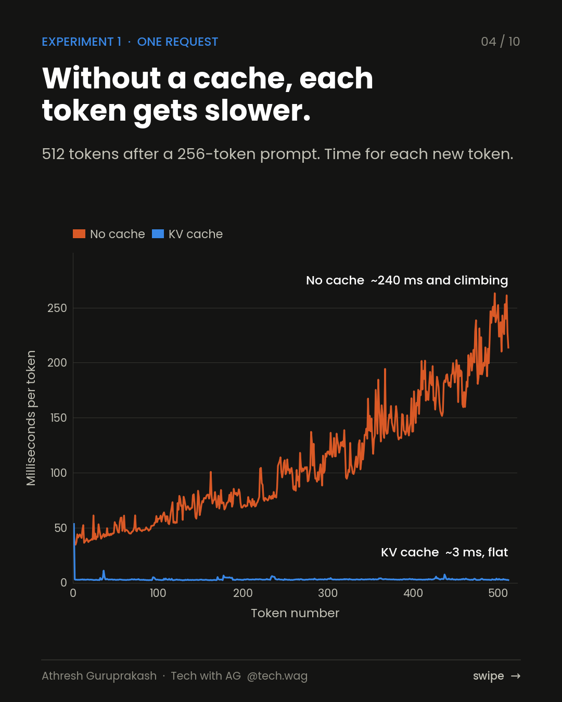
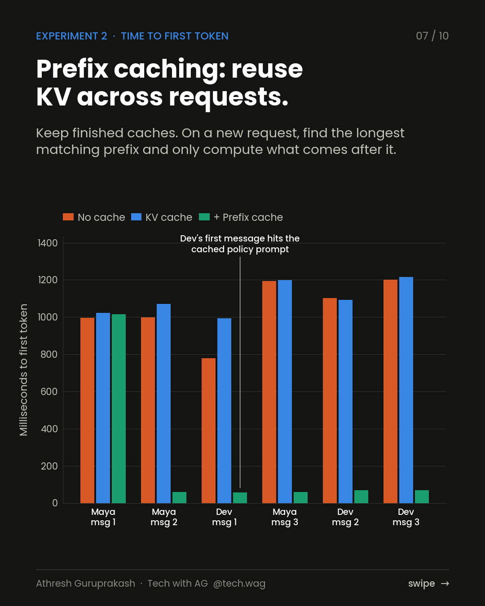

# Cache Me If You Can

**The KV cache from scratch in NumPy: 36× faster generation, measured on a real support chatbot.**

A decoder-only transformer written from scratch in NumPy (no PyTorch, no frameworks), served three ways:

| Strategy | What happens per generated token |
|---|---|
| **No cache** | The whole sequence is pushed through every layer again |
| **KV cache** | Only the new token is computed; old keys/values are read back |
| **KV + prefix cache** | Caches survive across requests, so shared system prompts and chat history are never recomputed |

The workload is a customer-support copilot for a fictional card issuer: a 1,759-token policy prompt, two customers, three messages each, arriving interleaved, exactly the pattern a production chatbot sees.

<p align="center">
  
  
</p>

## Results

**Model:** 4 layers, d=256, 8 heads, 4.3M params, NumPy on 2 CPU cores

### One request: 512 tokens after a 256-token prompt

| | Total time | Token positions computed | Last token |
|---|---|---|---|
| No cache | 56.10s | 261,888 | 213.6 ms |
| KV cache | 1.56s | 767 | 2.4 ms |

Speed-up: **36x**, identical output tokens: **True**

### Support copilot: 6 requests, 32 reply tokens each

| Strategy | Total time | Token positions computed | Avg time to first token |
|---|---|---|---|
| No cache | 202.15s | 380,672 | 1045 ms |
| KV cache | 7.45s | 11,989 | 1099 ms |
| KV + prefix cache | 2.30s | 2,477 | 222 ms |

Prefix cache, requests 2-6: avg time to first token **63 ms**, avg 96% of each prompt reused.

### KV cache memory, fp16

| Model | Attention | KiB / token | 8K context | 32 chats x 8K |
|---|---|---|---|---|
| GPT-2 small (124M) | MHA | 36 | 0.28 GiB | 9 GiB |
| Llama 2 7B | MHA | 512 | 4.00 GiB | 128 GiB |
| Llama 3 8B | GQA | 128 | 1.00 GiB | 32 GiB |
| Mistral 7B | GQA | 128 | 1.00 GiB | 32 GiB |
| Llama 3 70B | GQA | 320 | 2.50 GiB | 80 GiB |

Two things to keep in mind when reading these numbers:

- **Ratios, not milliseconds.** This is a 4.3M-parameter model on CPU. On a GPU with a 7B model the absolute times are different, but the shape is the same: without a cache, per-token cost grows with context length; with one, it stays nearly flat. The gap widens as context grows.
- **The weights are random,** on purpose. The project measures the inference engine, not what the model knows. The math per token is the same as a trained GPT-2-style model of this shape. To see real text, run `hf_demo.py` with GPT-2.

## Why caching K and V is safe

Attention is causal: token *i* only attends to tokens 0…*i*. So the key and value vectors at position *i* are final once computed; later tokens can never change them. The entire cache is these three lines in [`kvlab/model.py`](kvlab/model.py):

```python
cache.k[layer, :, start:end] = k   # write the new keys once
cache.v[layer, :, start:end] = v   # write the new values once
K = cache.k[layer, :, :end]        # attend over everything cached so far
```

The same property is what makes **prefix caching** work: the K/V of any prefix are identical no matter what follows, so a server can keep finished caches and reuse the longest matching prefix for the next request ([`kvlab/prefix_cache.py`](kvlab/prefix_cache.py)). This is the idea behind vLLM's automatic prefix caching, SGLang's RadixAttention and the prompt-caching features of hosted LLM APIs.

The benchmarks check correctness rather than assume it: cached and uncached generation produce identical tokens, and logits agree at every position to within float32 rounding.

## Run it

```bash
pip install -r requirements.txt
python bench/run_benchmarks.py          # ~5 min on a laptop CPU  (--quick for ~2 min)
python bench/report.py                  # results as Markdown tables
```

Optional, with a real pretrained model:

```bash
pip install torch transformers
python hf_demo.py                       # GPT-2 with use_cache=False vs True
```

## Layout

```
kvlab/
  model.py          TinyGPT + KVCache (the whole mechanism, <200 lines)
  generate.py       generation loops with and without the cache
  prefix_cache.py   longest-prefix reuse across requests, LRU eviction
  support_bot.py    the support-copilot workload and the three serving strategies
  memory.py         KV cache size for real model shapes (MHA vs GQA)
  tokenizer.py      byte-level tokenizer
bench/
  run_benchmarks.py all experiments -> results/results.json
  report.py         headline tables
docs/
  slide-04.png      Experiment 1 chart (per-token latency)
  slide-07.png      Experiment 2 chart (time to first token)
hf_demo.py          same idea on GPT-2 via Hugging Face
```

## License

MIT. Built by Athresh Guruprakash · [Tech with AG](https://instagram.com/tech.wag)
